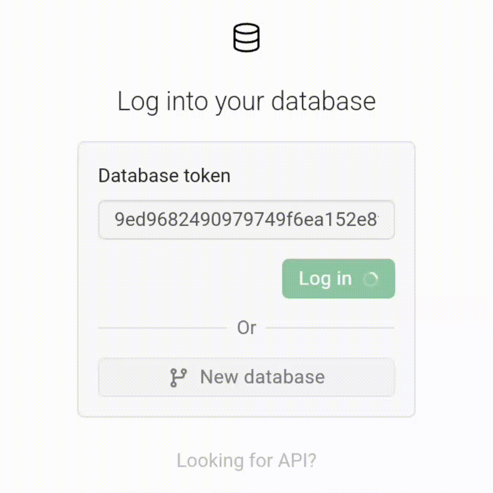

# pocketdb-api

Handcrafted REST API for [pocketdb.js](https://gist.github.com/creuserr/a6b445c27ff248b3971c0a65bcd89a35) &mdash; pocket database wrapper for [telegra.ph](https://telegra.ph)

```json5
// GET https://pocketdb-api.vercel.app/get?token=my-token&key=users
{
  "success": true,
  "result": {
    "list": ["users"],
    "data": [{
      "name": "John Doe",
      "age": 24,
      "email": "johndoe@example.com"
    }]
  },
  "request": {
    "endpoint": "/get",
    "token": "my-token",
    "key": "users"
  }
}
```

# Try it Online
`pocketdb-api` offers online usage at [/web/index.html](https://creuserr.github.io/pocketdb-api/web/index.html)



# Endpoints
| Endpoint | Method | Parameters |
|:--------:|:------:|:----------:|
| `/set` | POST | key, &ast;token |
| `/get` | GET | key, token |

*&ast; &ndash; Optional*

# Documentation
## `/set` with token
```
POST https://pocketdb-api.vercel.app/set?token=...&key=...
```

When utilizing `/set` with a token, it will modify or create data associated with the specified key, using the JSON content provided in the request body.

```js
await fetch("https://pocketdb-api.vercel.app/set?token=...&key=users", {
  method: "post",
  body: JSON.stringify({
    name: "John Doe",
    age: 24,
    email: "johndoe@example.com"
  })
})
```

The output would look like this:
```json5
{
  "success": true,
  "result": {
    "list": ["users"]
  },
  "request": {
  "endpoint": "/set",
    "key": "users",
    "value": {
      "name": "John Doe",
      "age": 24,
      "email": "johndoe@example.com"
    },
    "token": "..."
  }
}
```

## `/set` without token
```
POST https://pocketdb-api.vercel.app/set?&key=...
```

When using `/set` without a token, it will initiate a new database and insert data associated with the provided key, using the JSON content provided in the request body.

```js
await fetch("https://pocketdb-api.vercel.app/set?key=users", {
  method: "post",
  body: JSON.stringify({
    name: "John Doe",
    age: 24,
    email: "johndoe@example.com"
  })
})
```

The output would look like this:
```json5
{
  "success": true,
  "result": {
    "list": ["users"],
    "token": "..."
  },
  "request": {
    "endpoint": "/set",
    "key": "users",
    "value": {
      "name": "John Doe",
      "age": 24,
      "email": "johndoe@example.com"
    }
  }
}
```

## `/get`
```
GET https://pocketdb-api.vercel.app/get?token=...&key=...
```

This endpoint retrieves data content associated with the provided key and returns it in JSON format.

```js
await fetch("https://pocketdb-api.vercel.app/get?token=...&key=users")
```

The output would look like this:
```json5
{
  "success": true,
  "result": {
    "list": ["users"],
    "data": {
      "name": "John Doe",
      "age": 24,
      "email": "johndoe@example.com"
    }
  },
  "request": {
    "endpoint": "/get",
    "key": "users",
    "token": "..."
  }
}
```

## Errors

| Endpoint | Error | Message | Cause |
|:--------:|:-----:|:-------:|:-----:|
| `/set` | `INCOMPLETE_PARAM` | Incomplete parameters. Please view the documentation https://github.com/creuserr/pocketdb-api/blob/main/README.md#documentation for more information. | The parameter `key` is required. As well as the body as JSON. |
| `/set` | `INVALID_BODY` | Body is not properly encoded. Please view the documentation https://github.com/creuserr/pocketdb-api/blob/main/README.md#documentation for more information. | Body must be a valid stringified JSON. *String is expected* |
| `/set` | `INVALID_METHOD` | POST is the only method accepted for the endpoint /set | The endpoint `/set` only accepts the `POST` method. |
| `/get` | `INCOMPLETE_PARAM` | Incomplete parameters. Please view the documentation https://github.com/creuserr/pocketdb-api/blob/main/README.md#documentation for more information. | The parameters `key` and `token` are required. |
| `/get` | `INVALID_METHOD` | GET is the only method accepted for the endpoint /get | The endpoint `/get` only accepts the `GET` method. |
| `/set` or `/get` | `INTERNAL_ERROR` | *Error Message* | This error may vary depending on the raised error. Possible causes include invalid JSON, connection failure, database not found (token doesn't exist), or key not found. |

```json5
// Example Error:
// POST https://pocketdb-api.vercel.app/get?token=...&key=...

{
  "success": false,
  "error": "INVALID_METHOD",
  "message": "GET is the only method accepted for the endpoint /get",
  "request": {
    "token": "...",
    "key": "...",
    "endpoint": "/get"
  }
}
```
